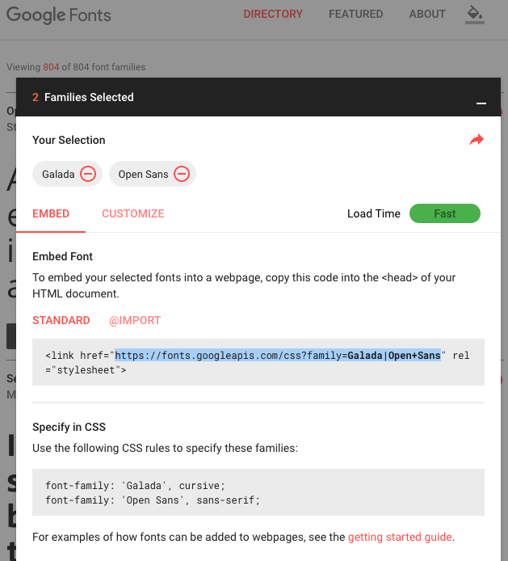
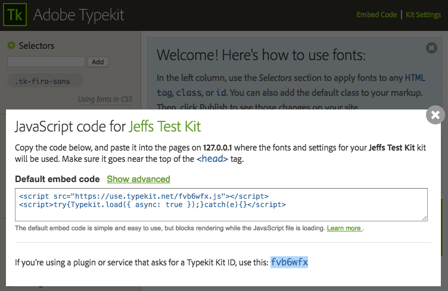
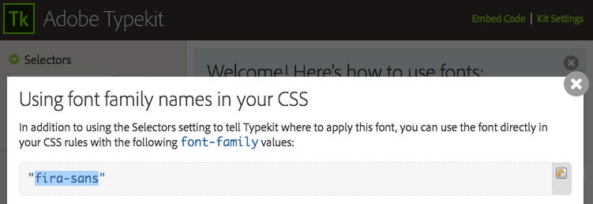
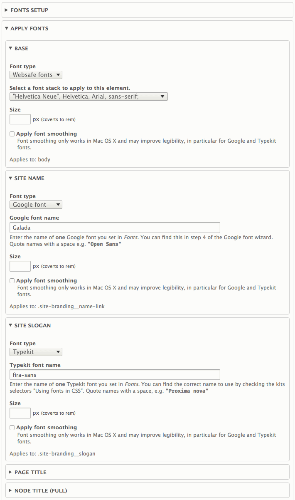

## Fonts Overview

The Fonts extension allows you to add new fonts to your site and apply them to elements.

The process of setting up your fonts is two part:

- Fonts setup: define the fonts you want to use in your site.
- Applying fonts: apply defined fonts to site elements.

### Fonts Setup

Here you can define three types of fonts - websafe stacks, Google fonts and a Typekit library (ID).

#### Web safe font stacks

Define font stacks for commonly used fonts that are on most computers in use today. An excellent source of information on web safe fonts is available at [www.cssfontstack.com](http://www.cssfontstack.com)

All sub-themes ship with default stacks. There is a variety of stack types - serif, san serfif, headline and monospace.

Enter one font stack per line using standard CSS syntax: quote fonts name with spaces, separate font names with a comma, end the line with a semi-colon.

#### Google Fonts

First visit [fonts.google.com](https://fonts.google.com). Here you select the fonts you want to use, then copy the URL from the link elements in the Standard method, e.g.:

The link element is:

`<link href="https://fonts.googleapis.com/css?family=Galada|Open+Sans" rel="stylesheet">`

Copy the URL:

`https://fonts.googleapis.com/css?family=Galada|Open+Sans`

And paste it into the text field.

Take note of the "Specify in CSS" field - you will use the names as they are shown there when you need to apply the google font to elements in the Apply Fonts section.

#### Typekit

In the Typekit kit settings, open the Embed Code link, from there copy the Typekit Kit ID:

And paste the ID into the Typekit ID field in Fonts Setup.

Close the Embed Code dialog and click _Using fonts in CSS_, a new dialog opens where you can see the actual font name to use in the Apply Fonts element fields.

### Applying Fonts to Elements

Applying fonts is strait forward:

1. Select the font type to be applied to the element.
2. Enter or select the font.

Remember to refer to either Google "Specify in CSS", or Typekits _Using fonts in CSS_ information to know the actual font name as it should be used in CSS.

- Web safe fonts will be in a select list.
- For Google and Typekit enter the font name.

#### Size
You can override the font-size per element. Normally your sub-theme will provide font-sizes in the themes CSS, however here you can set your own sizes. ALl sizes are entiered in pixels and are converted to rem units before being saved. Both px and rem are used in the CSS for browsers that don' support rem.

#### Font smoothing
Smoothing can improve legibility for web fonts. Currently font smoothing is only supported by some browsers (Webkit and Firefox on OSX). Refer to the docs at [caniuse.com](http://caniuse.com/#feat=font-smooth).

Below is an example using a Google, Typekit and Web safe font for three different elements.

