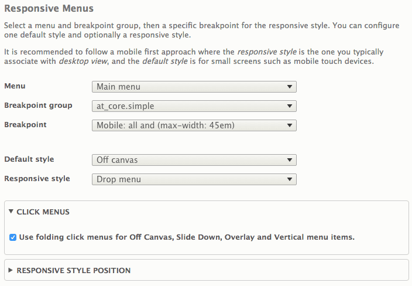

## Overview

Adaptivetheme supports Responsive menus for one menu block - typically your main navigation block.

There are eight responsive menus styles and you can choose any one of them for either the default or responsive style.

Below is a montage of some of the styles you can use - clockwise from top left: Drop menu, Slide down, Overlay, Mega nav, Off canvas.

Responsive menu styles are set in the Responsive Menus extension settings:

### Menu

Select any menu block to use as the responsive menu. This block can be placed in any region but must be enabled before it will show in the list.

While the menu block can be in any region some thought is required here with regards to the style fo menu, for example it will not make sense to use a drop-menu style if the block is in a narrow sidebar region.

#### Sub-menus not showing?

- First configure your menu blocks "Maximum number of menu levels to display".
- Next configure the actual menu items - each parent item must be set to "expanded".

### Breakpoints
``
Breakpoints are supplied using Drupal cores Breakpoints module in and defined in `t_core.breakpoints.yml`. Please see the page on [Breakpoints](../breakpoints.md) for more information on at_core breakpoint groups.

If you change the breakpoint group you will be prompted to save the theme settings so the form can reload with the new individual breakpoints in "Breakpoint" select list.

#### max-width or min-width?

**max-width** media queries will activate the _Default_ style when the screen is _narrower_ than the max-width, and the _Responsive_ style when the screen is _wider_ than the max-width.

Using max-width is a mobile first approach where we consider the "default" to be mobile.

For example:

- Media query: all and `(max-width: 45em)`
- Default: Off canvas - shows when _narrower_  than 45em
- Responsive: Drop menu - shows when _wider_ 45em

**min-width** media queries will activate the _Default_ style when the screen is _wider_ than the min-width, and the _Responsive_ style when the screen is _narrower_ than the min-width.

Using min-width is more like a desktop first approach where we consider "default" to be wide screens.

For example:

- Media query: `all and (min-width: 60.063em)`
- Default: Off canvas - shows when _wider_  than 60.063em
- Responsive: Slide down - shows when _narrower_ 60.063em

### Styles

There are eight styles to choose from.

**Horizontal**

Standard horizontal inline menu, without drop downs.

**Vertical**

Standard vertical menu, supports click menus.

**Drop menu**

Standard drop menu implimentation, supports unlimited levels.

**Slide-down**

Standard hamburger/slide-down mobile menu - supports click menus.

**Mega nav**

Intial view is like a horizontal menu with a toggle button. When toggled the horizontal menu becomes vertical with all submenu items showing horizontally inline withe their parents. This pattern was popularized by The Guardian news website.

**Off canvas**

Standard off canvas slider - the menu is hidden off-page (by default the them left) with a toggle button that slides the page to the right revealing the menu. Supports click menus

**Overlay**

Toggle button that reveals a transparent overlay "over" the site with menu items - supports click menus.

**Tiles**

Only shows the top level items in tile boxes.

### Click Menus

The click menu option hides sub-menus that are revealed when the click-button for that level is clicked or touched. Click menus are a space saving device that allows you to have very long or deep menus without overwhelming the site visitor.

Styles supporting Click menus are:

- Vertical
- Slide-down
- Off canvas
- Overlay

Click menus are enabled by default.

